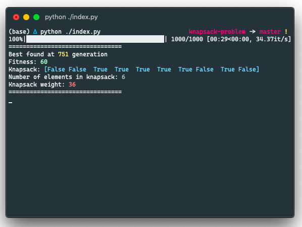
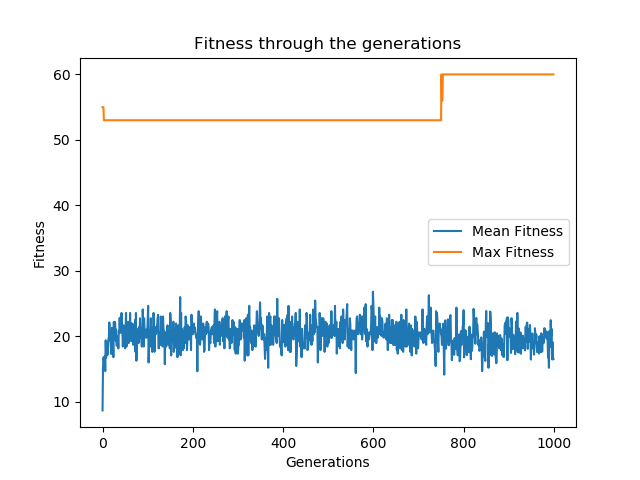

# Genetic Algorithm for knapsack problem
I've created my implementation of genetic algorithm for knapsack problem to pass my `University` lecture.

## How to use
If you are using `python3.x` just simply type below command to your shell:
```bash
python ./index.py
```

## Technology used

- [x] NumPy - to store knapsack and individuals inside Population,
- [x] tqdm - to display progress bar,
- [x] matplotlib - plots, 


## Results

For defined list:
| No  | Cost  | Weight  |
|:---|---:|---:|
| *1*  | 10  | 10  |
| *2*  | 15  | 14  |
| *3*  | 20  | 15  |
| *4*  | 6  | 3  |
| *5*  | 3  | 1  |
| *6*  | 23  | 13  |
| *7*  | 7  | 3  |
| *8*  | 11  | 12  |
| *9*  | 1  | 1  |
| *10*  | 5  | 10  |

Configuration:
| Parameter  | Value  |
|---|---|
| Generation Number  |  1000 |
| Population Size  |  200 |
| Crossover Ratio  |  90% |
| Mutation Ratio  |  60% |
| Selection method  |  Roulette before 3/4 Generation, after that tournament |
| Crossover method  | One Point Crossover  |
| Mutation method  | Bit Flip Mutation  |


